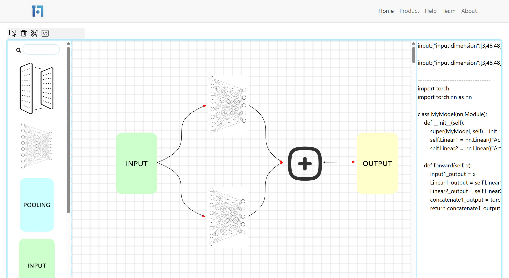

# Scratch-AI
Build neural networks the same way you do with legos.

After constructing a valid Neural Network structure, the corresponding inference code implemented via **Pytorch** could be generated. Then, utilize the hotkey `ctrl + s` to save the code file.

This project is still under **rapid** development and currently only supports a selected collection of blocks(classes & operations).

We draw inspirations from [ENNUI](https://github.com/martinjm97/ENNUI). Make sure to check out their amazing work!